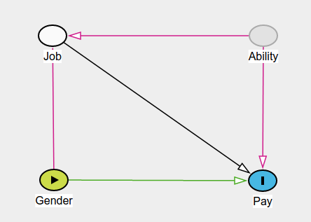

layout: true
  
<div class="my-header"></div>

<!-- the following lines define the header and the footer line: -->
<div class="my-footer"><span>`r params$semester`    
&emsp;&emsp;&emsp;&emsp;&emsp;&emsp;
&emsp;&emsp;&emsp;&emsp;&emsp;&emsp;&emsp;&emsp;&emsp;&emsp;&emsp;&emsp;&emsp;
`r params$instructor` | `r params$foottitle` </span></div> 

<div class="footer-line"></div>


```{r setup, include=FALSE}
library(emojifont)
library(knitr)

library(ggdag)


# House Price
co <- data.frame(x=c(0,0,1), y=c(1,0,0), name=c("C", "X", "Y")) 

DAG_Immo <- dagify(X ~ C,
       Y ~ X,
       Y ~ C, coords = co) %>% 
  ggdag(node_size = 20, text_size = 8, text = TRUE, text_col = "lightgray") + theme_dag_blank() +
  geom_dag_edges(arrow_directed = grid::arrow(length = grid::unit(15, "pt"), type = "closed"))  + 
  geom_text(label = "C - Living area\nX - Bedrooms \nY - Price", 
            hjust = 1, vjust = 1,
            x = 1, y = 1, size = 7, color = "darkgrey")

# Dating
co <- data.frame(x=c(0,1,2), y=c(1,0,1), name=c("Y","C","X"))

DAG_Date <- dagify(C ~ Y,
                  C ~ X, coords = co) %>% 
  ggdag(node_size = 20, text_size = 8, text = TRUE, text_col = "lightgray") + theme_dag_blank() +
  geom_dag_edges(arrow_directed = grid::arrow(length = grid::unit(15, "pt"), type = "closed"))  + 
  geom_text(label = "Y - Looking\nX - Kindness\nC - Date",
            hjust = 0.5, vjust = 1,
            x = 1, y = 1, size = 7, color = "darkgrey")

library(mosaic)

theme.fom <- theme_classic(22*1.04)
theme.fom <- theme.fom
theme_set(
  theme.fom  
)
options(scipen=999)


```


---

class: center, inverse, middle

## [EDC Oceans of Data Institute:](http://oceansofdata.org/sites/oceansofdata.org/files/ODI%20Data%20Literacy%20Report_0.pdf) The data-literate individual understands,  explains, and documents the utility and  limitations of data by becoming a critical consumer of data, controlling his/her personal data trail, finding meaning in data, and taking action based on data. The data-literate individual can identify, collect, evaluate, analyze, interpret, present, and protect data.


---

## What you may learn - or already know?

```{r, echo= FALSE , out.width = "15%", fig.align="center"}
ggplot() + geom_emoji("woman_teacher") + theme_void()
```

To take the best action or causal conclusion based on multivariate (observational) data analysis:

- Data is not just there - it has a generating process and we should care about this.

- Confounding and bias can be serious issues for causal inference.

- Adjusting or not adjusting. Both  can be bad ideas for causal inference.

- Quantitative model checks may not reveal which model is best for causal inference.

- Structural causal models and directed acyclic graphs can help to build a bridge between reality, theory and data.

--

```{r, echo= FALSE , out.width = "15%", fig.align="center"}
ggplot() + geom_emoji("crossed_fingers") + theme_void()
```


---

## Causal effect, potential outcomes and counterfactuals

Let $X_i$ be $1$ if someone attends this workshop and else $0$. Also let $Y_i$ be the somehow operationalized knowledge about causal inference:

- $Y_i^{|X_i=1}$: knowledge if attending (treatment group).

- $Y_i^{|X_i=0}$ knowledge if not attending (control group).

Be precise: What is the causal effect of attending?

--

E.g. Neyman–Rubin causal model:

$$\Delta_i = Y_i^{|X_i=1} -  Y_i^{|X_i=0}$$ 


But: For each $i$ we (usually) can only observe one of the **potential outcomes**. For *you* being here we can only observe $y_i^{|x_i=1}$. For  *you* $y_i^{|x_i=0}$ is the unobserved **counterfactual** outcome.

Also: There may be **confounding** covariates which may effect $X$ and $Y$ like e.g. $C$: cleverness. Therefore a naive analysis of e.g. $\bar{\delta}$ can be **biased**.

In randomized controlled trials allocation of $i$ to either $x_i$ being $0$ or $1$ is randomized. With this one hopes to balance the distribution of the covariates between treatment and control group.


---

class: center, inverse, middle

# First Example: Bedrooms and house price


---

## Saratoga Houses

Data on houses in Saratoga County, New York, USA in 2006. Analysis in `R`:

```{r SaratogaSP, out.width = "35%", fig.align="center"}
# Load package and read in data 
library(mosaic); data(SaratogaHouses)
# Scatterplot
gf_point(price ~ bedrooms, data = SaratogaHouses) %>%
  gf_lm(interval = "prediction")
```

.small[Idea: [De Veaux (2019). *Data Science for All*](https://iase-web.org/conference/satellite19/docs/Data%20Science%20for%20All.pdf)]


---

## Modelling value of my 2-bedroom house

Linear Model: ${\text{price}}_i = {\beta}_0 + {\beta}_{\text{bedrooms}} \times \text{bedrooms}_i + \epsilon_i$:

```{r}
# Linear Regression
my.model <- lm(price ~ bedrooms, data = SaratogaHouses); my.model 
```

So: $\hat{\beta}_{\text{bedrooms}}=`r round(coef(my.model)[2],2)`$

--

```{r}
# My house: 2 bedrooms; Point prediction
My.House <- data.frame(bedrooms = 2); predict(my.model, newdata = My.House)
```

$$\widehat{\text{price}}^{|\text{bedrooms}=2} \approx `r round(predict(my.model, newdata = My.House))`$$


---

## Turn data into money

```{r, echo= FALSE , out.width = "15%", fig.align="center"}
ggplot() + geom_emoji("money_mouth_face") + theme_void()
```

Split one bedroom into three!

--

```{r}
# My rebuilt house: now 4 bedrooms
My.NewHouse <- data.frame(bedrooms = 4)
# My money (?)
predict(my.model, newdata = My.NewHouse) - predict(my.model, newdata = My.House)
```

So:

$$\widehat{\text{price}}^{|\text{bedrooms}=4} - \widehat{\text{price}}^{|\text{bedrooms}=2} = (4-2) \times \hat{\beta}_{\text{bedrooms}}=`r 2*round(coef(my.model)[2],2)`$$

---

## Really?

Make three bedrooms out of one and the value of my house goes up by $\approx 100.000$ Dollar?

--

.center[<iframe src="https://giphy.com/embed/xTiTnHXbRoaZ1B1Mo8" width="480" height="271" frameBorder="0" class="giphy-embed" allowFullScreen></iframe>]

.small[[via GIPHY](https://giphy.com/gifs/debate-donald-trump-septgopdebate2015-xTiTnHXbRoaZ1B1Mo8)]


---

## Causal Model

The number of bedrooms depends on the house size - as well as the price (**confounding**/ **lurking** variable):

```{r echo=FALSE, out.width = "40%", fig.align="center"}
DAG_Immo
```


---

## Omitted-variable bias

Ok, let's **adjust** for `livingArea`:

```{r}
my.adj.model <- lm(price ~ bedrooms + livingArea, data = SaratogaHouses); my.adj.model
```

Now: $\hat{\beta}_{\text{bedrooms}}=`r round(coef(my.adj.model)[2],2)`$ (instead of $\hat{\beta}_{\text{bedrooms}}=`r round(coef(my.model)[2],2)`$ unadjusted for ` livingArea`). So: price falls instead of rises if I split a bedroom. (**Simpson's Paradox**)


<br>

--

*Hey, can't I just use e.g. `xgboost` with all variables?*


---

## Fancy machine learning method

```{r, echo= FALSE , out.width = "15%", fig.align="center"}
ggplot() + geom_emoji("thinking") + theme_void()
```

.center[*Hey, can't I just use e.g. `xgboost` with all variables?*]

.small[BTW: `mlr3`: A modern object-oriented machine learning framework in `R` ([Lang et al., 2019](https://joss.theoj.org/papers/10.21105/joss.01903))]

--

```{r, echo= FALSE , out.width = "15%", fig.align="center"}
ggplot() + geom_emoji("cry") + theme_void()
```

Unfortunately: Depending on task **not always** and quantitative measures like e.g. cross-validated mean squared error **not always** tell you which model is best for causal inference. 

.small[BTW: Nice blog: [Landesberg, Davies and Yee (2019). *Want to make good business decisions? Learn causality*](https://multithreaded.stitchfix.com/blog/2019/12/19/good-marketing-decisions/)]


---

## Try yourself! Gender pay gap

```{r, echo= FALSE , out.width = "15%", fig.align="center"}
ggplot() + geom_emoji("computer") + theme_void()
```

<br>

Try to model the gender pay gap: [http://dagitty.net/dags.html](http://dagitty.net/dags.html)

- New graph: `Model -> New Model`

- To add variable: Click on canvas

- To add arrow: Click on cause variable, than click on effect variable

<br>

.small[Of course you can also draw your causal diagram on a piece of paper!]


---

class: center, inverse, middle

# Some more words about data science


---

## Data science tasks

.center[<iframe src="https://giphy.com/embed/A06UFEx8jxEwU" width="240" height="177" frameBorder="0" class="giphy-embed" allowFullScreen></iframe>]

.small[[via GIPHY](https://giphy.com/gifs/code-matrix-wallpaper-A06UFEx8jxEwU)]


-  [Shmueli (2010)](https://projecteuclid.org/euclid.ss/1294167961) asked: *To Explain or to Predict?*

-  [Hernán et al. (2019)](https://doi.org/10.1080/09332480.2019.1579578) distinguished:
   - **Description**: "How can women aged 60–80 years with stroke history be partitioned in classes defined by their characteristics?"
   - **Prediction**: "What is the probability of having a stroke next year for women with certain characteristics?"
   - **Causal inference**: 	"Will starting a statin reduce, on average, the risk of stroke in women with certain characteristics?"


---

## Common pitfalls

[Smith and Cordes (2019). *The 9 Pitfalls of Data Science*](https://global.oup.com/academic/product/the-9-pitfalls-of-data-science-9780198844396):

1.  Using Bad Data

2.  Putting Data Before Theory

3.  Worshipping Math

4.  Worshipping Computers

5.  Torturing Data

6.  Fooling Yourself

7.  Confusing Correlation with Causation

8.  Being Surprised by Regression Toward the Mean

9.  Doing Harm


---

## Data clown (?)

.center[<iframe width="560" height="315" align="middle" src="https://www.youtube.com/embed/uHGlCi9jOWY" frameborder="0" allow="accelerometer; autoplay; encrypted-media; gyroscope; picture-in-picture" allowfullscreen></iframe>]

> But it's a shallow journey if ONLY the machine's learning


---

## Causal inference

.center[Are you ready for causal inference?]

<br>


.center[<iframe src="https://giphy.com/embed/udhR8Hh1YVM6Q" width="480" height="270" frameBorder="0" class="giphy-embed" allowFullScreen></iframe>]

.small[[via GIPHY](https://giphy.com/gifs/pill-udhR8Hh1YVM6Q)]


---

## Levels of causal inference


[Pearl (2019)](https://doi.org/10.1145/3241036) establishes a three-level hierarchy:

- **Association**: $P(y|x)$: Seeing: *what is?*, i.e., the probability of $Y=y$ given that we observe $X=x$.

- **Intervention**: $P(y|do(x))$: Manipulation: *what if?*, i.e., the probability of $Y=y$ given that we intervene and set the value of $X$ to $x$.

- **Counterfactuals**: $P(y_x|x',y')$: Imagining: *what if I had acted differently?*, i.e., the probability of $Y=y$ if $X$ had been $x$ given that we actually observed $x',y'$.

--

[Witmer (2020)](https://doi.org/10.1080/00029890.2020.1671757):

> The  scientific  community  would  benefit  greatly  from  a  better  understanding of causal inference - and "better" is quite a low bar, given how little the tools of causal reasoning have been used over the years. But statisticians have stood in the way, insisting that cause-and-effect conclusions can only be drawn from randomized experiments and delighting in telling stories about confounded effects that arise when analyzing observational data, all while repeating the  mantra  that correlation is  not  causation. In so doing, we statisticians congratulate ourselves too much, while turning students away from asking and answering questions of genuine interest. At the same time, we hamper the advancement of scientific and societal progress.

---

## One page of theory

- $X \rightarrow Y: \quad Y=f(X, U_Y)$ with some function $f(\cdot)$ and some exogenous $U$. 

- The value of $Y$ depends on $X$ - but the value of $X$ **not** on $Y$. 

- Causally there is no inverse function $f^{-1}(\cdot)$. My weight growths with my height but unfortunately my height not with my weight.

<br>


| Path                       | $X \rightarrow C \rightarrow Y$ | $X \leftarrow C \rightarrow Y$ | $X \rightarrow C \leftarrow Y$ 
| ---------------------------|---------------------------------|--------------------------------|------------------------------|
| Name                       | Chain                           | Fork                           | Collider         
| Association $X$ to $Y$     | Causal                          | Non-causal                     | None                       
| Adjusting $C$              | Blocks causal path              | Blocks non-causal path         | Opens non-causal path

<br>

**Idea**: To estimate the change in $y$ if $x$ is changed: Block non-causal paths, open causal paths and don't open a biasing path.


---

## Conditional and unconditional independence

```{r, echo= FALSE , out.width = "15%", fig.align="center"}
ggplot() + geom_emoji("sunny") + theme_void()
```

**Example**: sunscreen  $\leftarrow$ sunshine  $\rightarrow$ ice cream 

  - Knowing sunscreen I learn via sunshine something about ice cream. Unconditionally, i.e. marginal, they are not independent. Formally: $X \not\!\perp\!\!\!\perp Y$
  
  - Knowing sunshine I don't learn more about ice cream by sunscreen. Conditionally on sunshine they are independent. Formally: $X{\perp\!\!\!\perp}Y|C$


---

## More on conditional and unconditional independence

```{r, echo= FALSE , out.width = "15%", fig.align="center"}
ggplot() + geom_emoji("sleeping") + theme_void()
```

**Example**: weekend  $\rightarrow$ sleep  $\leftarrow$ holiday

  - Knowing that it is weekend I learn nothing about whether it is holiday or not: Unconditionally, i.e. marginal, they are independent. Formally: $X{\perp\!\!\!\perp}Y$
  
  - Knowing that I can sleep late and that it is not weekend I learn that it must be holiday: Conditionally on sleep they are not independent. Formally: $X \not\!\perp\!\!\!\perp Y|C$
  

---

## More on Chains, forks and colliders and graphs

Role of $C$:

- $X \rightarrow C \rightarrow Y$: $C$ is a mediator between $X$ and $Y$.

- $X \leftarrow C \rightarrow Y$: $C$ is a common cause of $X$ and $Y$.

- $X \rightarrow C \leftarrow Y$ : $C$ is a common effect of $X$ and $Y$.

<br>

Elements of a graph:

- All variables with an arrow into $Z$ are called parents of $Z$.

- All variables with an arrow from $Z$ are called children of $Z$.

- No arrow between two variables indicate that there is no direct association between them. 


---

## Try yourself! Causal effect in gender pay gap

```{r, echo= FALSE , out.width = "15%", fig.align="center"}
ggplot() + geom_emoji("computer") + theme_void()
```

.center[Assumed model of gender pay gap]

```{r echo=FALSE, out.width = "40%", fig.align="center"}

```

.small[Made with [DAGitty](http://dagitty.net/)]

Discuss what this model implies for estimating causal effects.


---

## Try yourself! Your data science question

```{r, echo= FALSE , out.width = "15%", fig.align="center"}
ggplot() + geom_emoji("computer") + theme_void()
```

Draw a simple causal diagram for a research question of your choice. What does this model imply?

<br>

[http://dagitty.net/dags.html](http://dagitty.net/dags.html) or a piece of paper.

<br>

.grey[E.g.: Test score and relation to learning time and intelligence.]

<br>

**Note**: Nodes (i.e. variables - observable and not-observable), arrows (i.e. dependencies) and omitted arrows (i.e. independencies) must be founded by theory!

---

class: center, inverse, middle

# A first simulated example


---

## Data generating process

.pull-left[
$$ X = U_X, \quad U_X \sim \mathcal{N}(0,\,1),$$
$$Y = X +  U_Y, \quad U_Y \sim \mathcal{N}(0,\,1),$$
$$Z = Y + U_Z, \quad U_Z \sim \mathcal{N}(0,\,0.1).$$
where $\mathcal{N}(\mu,\,\sigma)$ stands for normal distribution with mean $\mu$ and variance $\sigma^2$.
]

.pull-right[
In `R`:

```{r}
set.seed(1896)
x <- rnorm(100, mean = 0, sd = 1)
y <- x + rnorm(100, mean = 0, sd = 1)
z <- y + rnorm(100, mean = 0, sd = 0.1)
```

```{r, include=FALSE}
set.seed(1896)
x <- rnorm(100)
y <- x + rnorm(100)
z <- y + rnorm(100, sd = 0.1)
Chain <- data.frame(x=x, y=y, z=z)
```
]

So **causally**: 

<br>

$$X \rightarrow Y \rightarrow Z$$

**Note**: The outcome $Y$ is in the middle of the chain - not at the end.

<br>

.small[Idea: [https://fabiandablander.com/r/Causal-Inference](https://fabiandablander.com/r/Causal-Inference)]

---

## Modelling

.center[Modelling of $y$ by $x$ or $z$]

.pull-left[
```{r, echo=FALSE, fig.align="center", out.width="90%", fig.asp = 0.8}
gf_point(y~x, data = Chain) %>% gf_lims(x=c(-6,6)) %>% gf_vline(xintercept = ~2, linetype = "dashed") %>%
  gf_lm(interval = "prediction")
```
]

.pull-right[
```{r, echo=FALSE, fig.align="center", out.width="90%", fig.asp = 0.8}
gf_point(y~z, data = Chain) %>% gf_lims(x=c(-6,6)) %>% gf_vline(xintercept = ~2, linetype = "dashed") %>%
  gf_lm(interval = "prediction")
```
]


---

## Marginal and conditional distributions (association)

.center[Marginal, i.e. unconditional, distribution of $y$]

```{r echo=FALSE, out.width = "30%", fig.asp = 0.8, fig.align="center"}
gf_dist("norm", params = list(sd=sqrt(2))) %>% 
  gf_labs(x="y", y="f(y)") %>% 
  gf_lims(x=c(-6,6))
```


.pull-left[
Conditional distribution of $y$, **observing** $x=2$
```{r echo=FALSE, out.width = "60%", fig.asp = 0.8, fig.align="center"}
gf_dist("norm", params = list(mean=2, sd=1)) %>% 
  gf_labs(x="y", y="f(y|x=2)") %>% 
  gf_lims(x=c(-6,6))
```
]

.pull-right[
Conditional distribution of $y$, **observing** $z=2$
```{r echo=FALSE, out.width = "60%", fig.asp = 0.8, fig.align="center"}
gf_dist("norm", params = list(mean=2, sd=0.1)) %>% 
  gf_labs(x="y", y="f(y|z=2)") %>% 
  gf_lims(x=c(-6,6))
```
]


---

## Conditional distributions (intervention)

.pull-left[
Conditional distribution of $y$, **setting** $do(x)=2$
```{r echo=FALSE, out.width = "60%", fig.asp = 0.8, fig.align="center"}
gf_dist("norm", params = list(mean=2, sd=1)) %>% 
  gf_labs(x="y", y="f(y|do(x)=2)") %>% 
  gf_lims(x=c(-6,6))
```
]

.pull-right[
Conditional distribution of $y$, **setting** $do(z)=2$
```{r echo=FALSE, out.width = "60%", fig.asp = 0.8, fig.align="center"}
gf_dist("norm", params = list(mean=0, sd=sqrt(2))) %>% 
  gf_labs(x="y", y="f(y|do(z)=2)") %>% 
  gf_lims(x=c(-6,6))
```
]

--

<br>

.center[*Sex is not love - and association is not causation*]

<br> 

--

-  In associational setting: $z$ is better for predicting $y$.

-  In interventional setting: $x$ is better for predicting $y$.

--

**How should we know this without causal assumptions?**


---

class: center, inverse, middle

# A second simulated example


---

## Dating

**Assume** you date someone because he is good looking or because he is kind. Moreover assume that looking and kindness are independent.


```{r echo=FALSE, out.width = "40%", fig.align="center"}
DAG_Date
```


---

## Data generating process

$$X = U_X, \quad U_X \sim \mathcal{N}(0,\,1),$$
$$Y = U_Y, \quad U_Y \sim \mathcal{N}(0,\,1),$$
$$\widetilde{C} =\begin{cases} 1 & ,\, \text{if } \{ X > 1 \,\vee\, Y > 1\} \\ 0 & ,\, \text{else } \end{cases},$$
$$C = (1-U_C) \cdot \widetilde{C} + U_C \cdot (1- \widetilde{C}), \quad U_C \sim \mathcal{B}(0.05).$$
where $\mathcal{B}(\pi)$ stands for the Bernoulli distribution.

In `R`:

```{r}
set.seed(1896)

kind<- rnorm(1000)
look <- rnorm(1000)
dating <- ((kind > 1) | (look > 1)) 
luck <- rbinom(1000, size = 1, prob = 0.05)
dating <- (1 - luck) * dating + luck * (1 - dating)
```

```{r, include=FALSE}
Date <- data.frame(kind, look, dating=(dating==1))
```


---

## Modelling: Marginal

Modelling of `kind` by `look`:

```{r echo=FALSE, out.width = "50%", fig.asp = 0.8, fig.align="center"}
ggformula::gf_point(kind~look, data = Date) %>%
  gf_lm() + ggthemes::scale_color_colorblind()
```


---

## Modelling: Conditional

Modelling of `kind` by `look`, adjusted for `dating`:

```{r echo=FALSE, out.width = "50%", fig.asp = 0.8, fig.align="center"}
ggformula::gf_point(kind~look, color=~dating, data = Date) %>%
  gf_lm() + ggthemes::scale_color_colorblind()
```

- Adjusted for the common effect (dating) there is an association between the independent causes good looking and kindness (**Berkson's Paradox**).


---

## Selection/ Collider Bias

Modelling of `kind` by `look`, selected by `dating`:

```{r echo=FALSE, out.width = "50%", fig.asp = 0.8, fig.align="center"}
Dated <- Date %>% filter(dating==TRUE)
ggformula::gf_point(kind~look, data = Dated) %>%
  gf_lm() + ggthemes::scale_color_colorblind()
```

- There is also an association between the independent causes good looking and kindness if your data consists only of those who you dated.

---

class: center, inverse, middle

# Second Example: Smoking and lung function

---

## Try yourself! learnr tutorial 

```{r, echo= FALSE , out.width = "15%", fig.align="center"}
ggplot() + geom_emoji("computer") + theme_void()
```

<br>

`learnr` Tutorial with real data (in German): [https://fomshinyapps.shinyapps.io/KausaleInferenz/](https://fomshinyapps.shinyapps.io/KausaleInferenz/)

Associated RStudio Cloud project: [https://rstudio.cloud/project/876677](https://rstudio.cloud/project/876677)


---

class: center, inverse, middle

# Take home messages


---

## First of all

Remember: 

.center[**Data (and models thereof) are not the reality!**]

.center[<iframe src="https://giphy.com/embed/MPuTZQqOmYKPK" width="480" height="282" frameBorder="0" class="giphy-embed" allowFullScreen></iframe>]

.small[[via GIPHY](https://giphy.com/gifs/thegoodfilms-film-the-big-lebowski-dude-MPuTZQqOmYKPK)]


So: Always take your anti-hubristines! 


---

## Other lessons learned - hopefully

```{r, echo= FALSE , out.width = "15%", fig.align="center"}
ggplot() + geom_emoji("woman_teacher") + theme_void()
```

To take the best action or causal conclusion based on multivariate (observational) data analysis:

- Data is not just there - it has a generating process and we should care about this.

- Confounding and bias can be serious issues for causal inference.

- Adjusting or not adjusting. Both  can be bad ideas for causal inference.

- Quantitative model checks may not reveal which model is best for causal inference.

- Structural causal models and directed acyclic graphs can help to build a bridge between reality, theory and data.


---

## Want more?

Some References:

- [Dablander, F. (2019). An introduction to Causal inference (Blog)](https://fabiandablander.com/r/Causal-Inference)

- [Rohrer, J.M. (2018). Thinking Clearly About Correlations and Causation: Graphical Causal Models for Observational Data. Advances in Methods and Practices in Psychological Science, 1(1), 27–42.](https://doi.org/10.1177/2515245917745629)
    
- [Elwert, F. (2013). Graphical causal models. In: Handbook of causal analysis for social research (S. 245-273). Springer, Dordrecht.](https://www.researchgate.net/publication/278717528_Graphical_Causal_Models)
    
- [Pearl, J., Glymour, M., & Jewell, N. P. (2016). Causal inference in statistics: A primer. John Wiley & Sons.](http://bayes.cs.ucla.edu/PRIMER/)
    
- [Peters, J., Janzing, D., & Schölkopf, B. (2017). Elements of causal inference: foundations and learning algorithms. MIT press.](https://mitpress.mit.edu/books/elements-causal-inference)

<br> 

Also:

Several R packages exists, e.g. [`ggdag`](https://ggdag.netlify.com/).

.small[Other approaches to causal inference are e.g. within potential outcome framework, instrumental variables, regression discontinuity designs, Granger, natural experiments, ...]


---

## Own Work and contact


- [Lübke, K., Gehrke, M., Horst, J. & Szepannek, G. (2020). Why We Should Teach Causal Inference: Examples in Linear Regression with Simulated Data, Journal of Statistics Education.](https://doi.org/10.1080/10691898.2020.1752859)

- Lübke, K. &  Gehrke, M. (2020). *Now is the Time for Causal Inference in Introductory Statistics*, Proceedings IASE 2020 Roundtable New Skills in the Changing World of Statistics Education (accepted).

<br>

**Acknowledgement**:

I thank Matthias Gehrke, Jörg Horst, Sebastian Sauer and Gero Szepannek for their contributions!

<br>


- `r icon::fa("envelope")`: [karsten.luebke@fom.de](<mailto:karsten.luebke@fom.de>)
- `r icon::fa("twitter")`: [@luebby42](https://twitter.com/luebby42)
- `r icon::fa("github")`: [@luebby](https://github.com/luebby)


